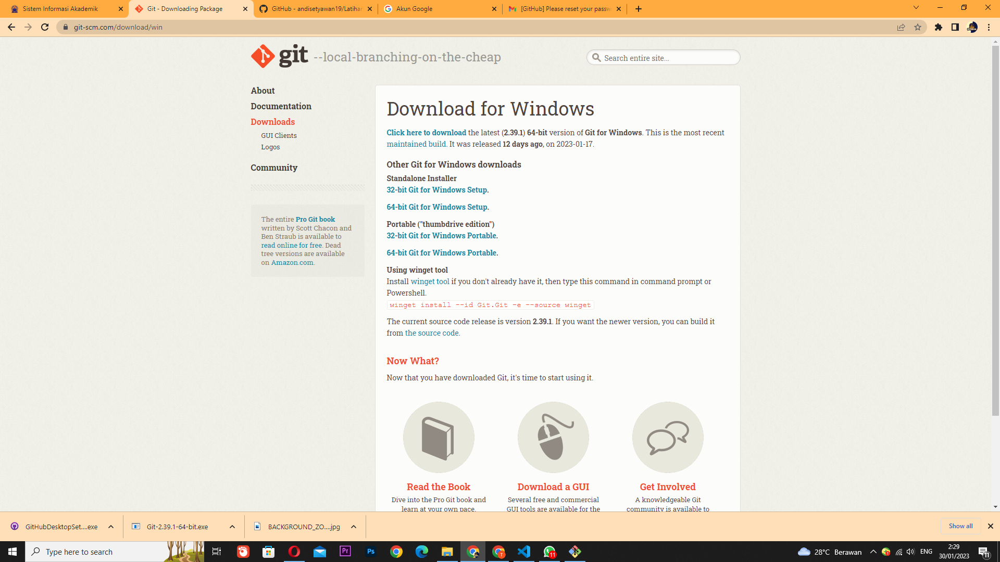
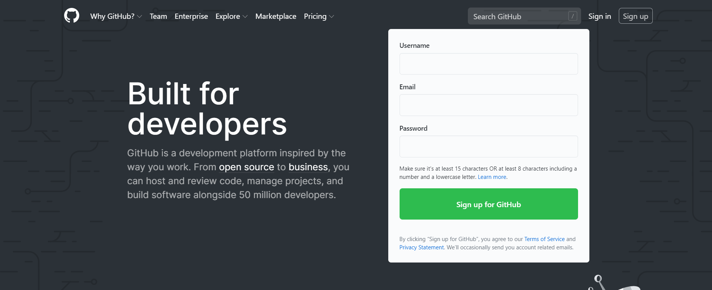
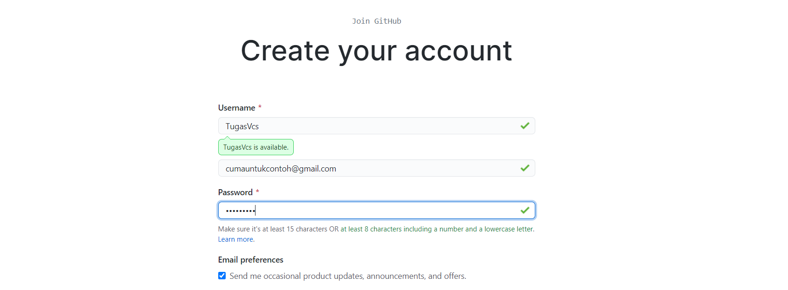
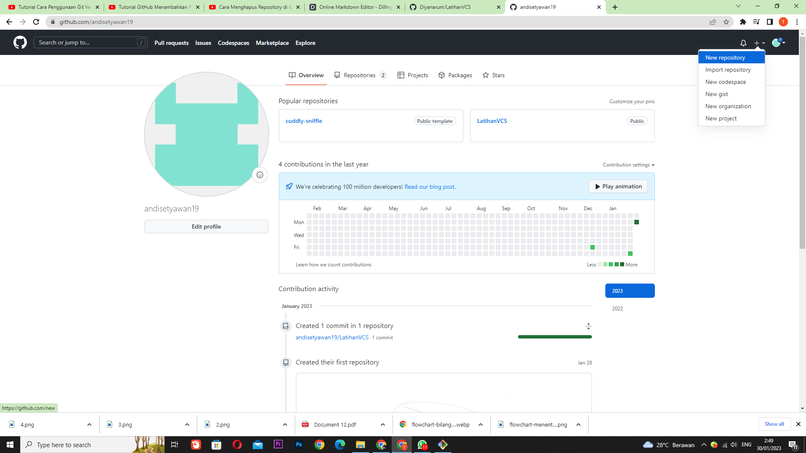
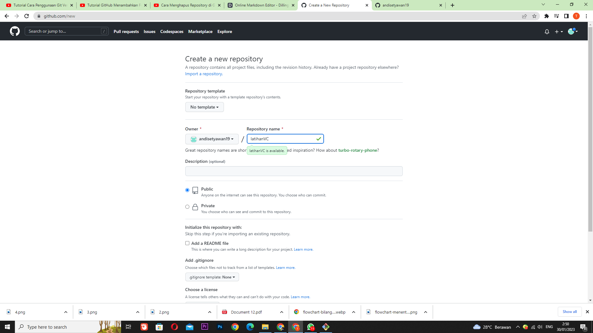
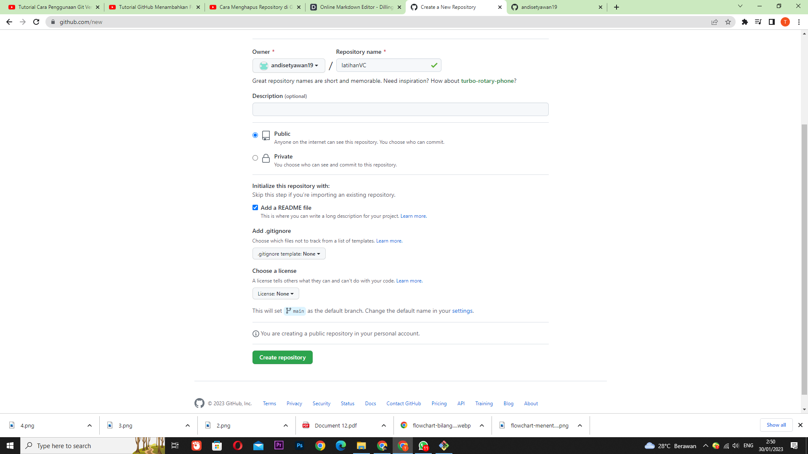
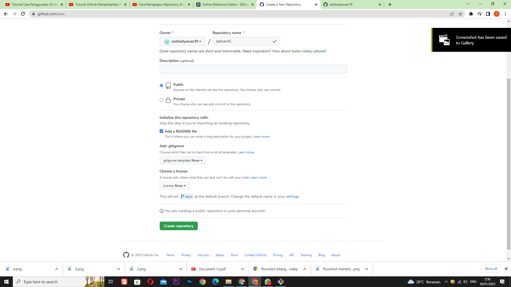

# LatihanVCS
### NAMA    : ANDI SETYAWAN
### NIM     : 312210724
### KELAS   : TI.22.C.9

### Langkah awal menggunakan Git

* ### CARA DOWNLOAD GIT
    - Hal pertama yang perlu kita lakukan jika ingin menggunakan aplikasi git tentu saja mendownloadnya. bagaimana caranya? pertama kalian buka situs resmi dari git itu sendiri yaitu *git-scm.com*.
    - setelah kalian mendapat tampilan seperti dibawah ini kalian bisa langsung saja mendownload dengan cara memilih terlebih dahulu yang sesuai dengan komputer kalian, apakah itu 32 bit atau 64 bit. stelah itu tekan maka akan terdownload otomatis.
 

- jika sudah terdownload maka lakukan penginstalan di pc kalian.
### LANGKAH AWAL MENGGUNAKAN GITHUB dan MEMBUAT REPOSITORY

* ### LOGIN AKUN GITHUB
  - Bukalah Github pada situs resminya yaitu *github.com*. Setelah itu pilih menu Sign Up yang terletak pada pojok kanan atas jika memang belum mempunyai akun.

  

 - Kemudian, isilah data & email kalian dengan benar.

 

 - setelah itu akan muncul beranda akun github kalian. setelah itu buat repository dengan cara klik tombol "+" di pojok kanan atas kemudian pilih new "repository".

 

 - Langkah selanjutnya isi nama repository yang ingin kalian buat.

 

 - Setelah mengisi nama, kemudian tambahkan file README.md pada repository.

 

 - kemudian klik tombol "create repository" sebagai langkah akhir mrmbuat repository.

 

 ### Selesai Selamat mencoba ya ges ya

[def]: screenshot/3.png